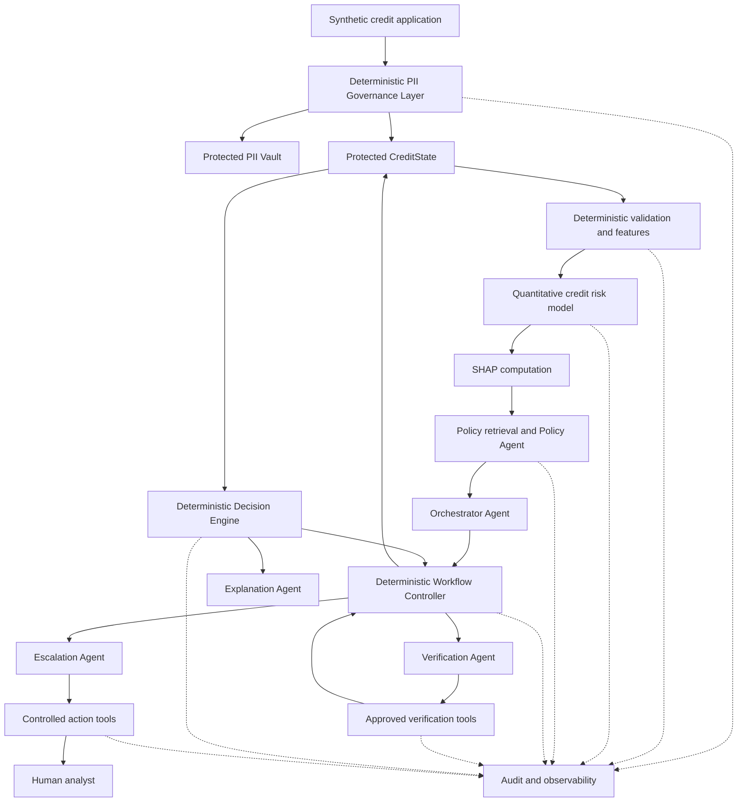
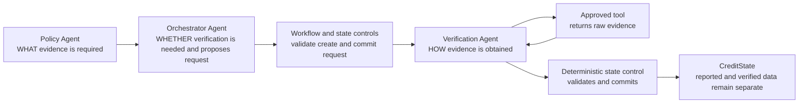
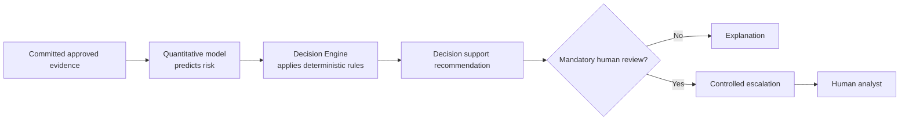
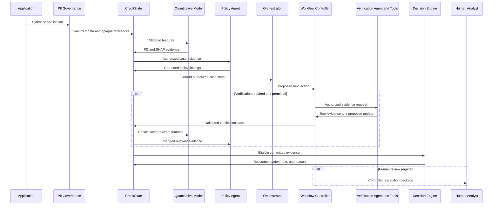

# CreditPilot Architecture Overview

## Status

Phase 0 approved and frozen architecture summary.

Approved and frozen on 2026-09-15.

This document is a readable overview of the approved CreditPilot V1
architecture. `docs/ARCHITECTURE_SPEC_V1.md` is the canonical source of truth
and takes precedence if any conflict exists.

## System Purpose

CreditPilot is an agentic AI credit risk decision-support system for a Credit
Risk Analyst or Underwriter. It combines deterministic validation and workflow
controls, quantitative credit-risk modelling, policy retrieval, bounded agent
reasoning, external evidence verification, explanation, controlled escalation,
and auditability.

CreditPilot is not an autonomous lending system. V1 uses synthetic, mock,
simulated, or suitable public demo data only.

## Component Architecture

The diagram is conceptual. It does not define a deployment topology, network
boundary, vendor, or physical data store.

## Responsibility Separation

| Layer | Responsibility | Must not do |
| --- | --- | --- |
| Deterministic software | Validation, calculations, permissions, transitions, recommendation rules, retry and loop limits | Delegate explicit control rules to unrestricted LLM reasoning |
| Quantitative ML | PD prediction, risk scoring, calibration, SHAP attribution | Make the final recommendation |
| LLM-enabled agents | Adaptive investigation, policy interpretation, tool selection, explanation, escalation preparation | Override protected state, quantitative outputs, recommendation authority, or human review |
| Tools | Perform typed and bounded retrieval, computation, verification, or action capabilities | Grant unrestricted state or external-system access |
| Human analyst | Perform required human review and retain human decision authority | Be silently bypassed by an agent |

## Approved Agent Architecture

CreditPilot V1 has exactly five LLM-enabled agents:

- Orchestrator Agent proposes the next investigation step.
- Policy Agent retrieves and interprets applicable synthetic policy.
- Verification Agent determines how to obtain requested evidence with approved
  tools.
- Explanation Agent explains existing approved evidence.
- Escalation Agent prepares and coordinates controlled human handoff.

Application validation, PII governance, feature engineering, the quantitative
model, SHAP, workflow enforcement, the Decision Engine, persistence, audit,
permissions, retries, and loop-limit enforcement are non-agent components.

## Verification Boundary

No single agent owns the complete verification decision chain. The Verification
Agent acts only on an approved committed request and may interpret, structure,
and propose updates but may not fabricate verified facts or bypass protected
state controls.

## Decision Authority

Before Decision Engine entry, the Workflow Controller checks whether committed
evidence is eligible. Ineligible cases route safely to human review. For
eligible cases, only the Decision Engine writes `recommendation`,
`decision_rule`, and `decision_reason`. After recommendation, the Workflow
Controller enforces mandatory review without rewriting the recommendation.

## Trust Boundaries

### Identity boundary

Raw identity PII and token mappings remain in a protected PII Vault. The main
workflow uses controlled references such as `application_id`, `case_id`, and
opaque `customer_token`.

Income, employment information, credit bureau information, and verified
financial evidence are Sensitive Credit Data. They may enter CreditState only
in structured, minimum-necessary, access-controlled form. Derived Risk Features
may enter protected CreditState under explicit ownership and minimum-context
controls.

### LLM boundary

LLM context is built with an allowlist, deterministically redacted, sanitized,
and limited to the minimum required for the agent role. Agent output is a
proposal until deterministic validation.

### State boundary

CreditState is protected. Each protected field has an explicit owner.
Deterministic workflow and state controls reject unauthorized mutations.

### Tool boundary

Tools are typed capabilities with explicit permissions and side-effect
boundaries. External actions require preconditions, authorization, sanitized
inputs, audit, deterministic approval, and idempotency where appropriate.

### Human boundary

Human review is an analyst-controlled workflow. Agents may prepare the handoff
but do not make the human decision.

## High Level Data Flow

## Failure and Audit Architecture

Model, SHAP, policy retrieval, verification, tool, agent-output, transition,
retry-limit, and loop-limit failures remain explicit. Failures must not produce
fabricated evidence or silent approval.

Every material step preserves relevant case references, versions, timestamps,
model and policy evidence, agent outputs, tool calls and outcomes, workflow
transitions, verification evidence, recommendation rules, escalation reasons,
and human-review outcomes where captured.

PII-access audit events remain separately identifiable from ordinary workflow
auditing.

## Related Specifications

- `docs/ARCHITECTURE_SPEC_V1.md` - canonical architecture.
- `docs/AGENT_DESIGN.md` - agent contracts and authority.
- `docs/STATE_DESIGN.md` - CreditState domains and ownership.
- `docs/TOOL_DESIGN.md` - typed tool capabilities and permissions.
- `docs/WORKFLOW.md` - canonical workflow expansion.
- `docs/CREDIT_POLICY_DESIGN.md` - synthetic policy and retrieval design.
- `docs/SECURITY_GOVERNANCE.md` - security, PII, and governance.
- `docs/EVALUATION.md` - evaluation design.
- `docs/DEMO_SCENARIOS.md` - Golden Demo definitions.
- `docs/BUSINESS_REQUIREMENTS.md` - high-level business framing.

## Open Decisions

Synthetic thresholds, verification providers, the human-review interface,
challenger model selection, and other explicitly open items remain subject to
human approval.

The approved Phase 1 baseline is scikit-learn Logistic Regression. Model
evaluation includes ROC-AUC, PR-AUC, Precision, Recall, F1, KS, and
Calibration; acceptance thresholds remain configurable and pending approval.

Credit data classification, verification-request ownership, and mandatory
review ordering were approved on 2026-09-15.
